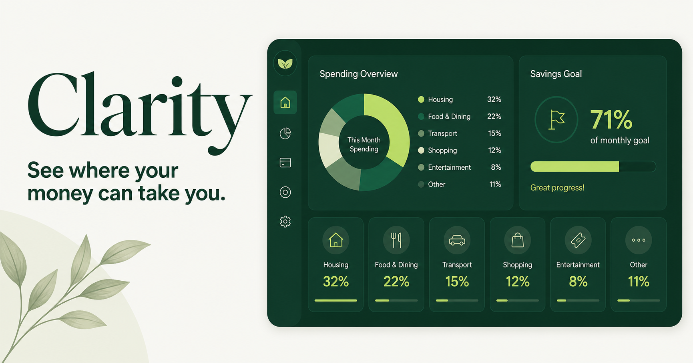

# Clarity Finance

Clarity is a calm personal-finance dashboard for understanding spending, detecting habits, tracking a monthly savings goal, and turning transaction patterns into practical saving ideas.



## Features

- Plaid-style account connection flow with a clearly labeled demo mode
- Daily and monthly transaction categorization
- Searchable transaction history with category filters
- Recurring-cost, weekday-routine, and weekend-spending habit detection
- Editable monthly savings goal and contribution tracking
- Personalized, one-click saving recommendations
- Responsive desktop, tablet, and mobile layouts
- Open Graph and X social-card metadata

## Demo status

The current account-connection flow uses representative data and does not contact a bank. Production Plaid support requires server-side link-token creation, public-token exchange, encrypted access-token storage, webhook verification, and user authentication. See [Plaid integration](docs/PLAID_INTEGRATION.md) before enabling live financial data.

## Tech stack

- React 19 and TypeScript
- vinext and Vite
- Tailwind CSS
- Cloudflare Workers-compatible server output
- OpenAI Sites hosting
- Optional Drizzle ORM and Cloudflare D1 support

## Prerequisites

- Node.js 22.13 or newer
- npm

## Local development

```bash
git clone <your-repository-url>
cd clarity-finance
cp .env.example .env.local
npm install
npm run dev
```

Open `http://localhost:3000`.

The existing demo does not require environment variables. Plaid variables in `.env.example` are placeholders for the future server-side integration.

## Quality checks

```bash
npm run build
npm test
npm run lint
```

## Project structure

```text
app/                    Application UI and metadata
db/                     Optional D1/Drizzle schema and helpers
docs/                   Architecture and integration guidance
public/                 Static assets and social preview
tests/                  Rendered-output tests
worker/                 Cloudflare-compatible entrypoint
.openai/hosting.json    Sites resource declarations
```

## Deployment

The project is configured for OpenAI Sites and emits Cloudflare Worker-compatible output. The current private deployment is available at [clarity-finance.sharonyan315.chatgpt.site](https://clarity-finance.sharonyan315.chatgpt.site).

## Security and privacy

Never commit Plaid secrets, access tokens, bank credentials, real transaction exports, or personally identifiable financial data. Review [SECURITY.md](SECURITY.md) and the Plaid integration notes before connecting real accounts.

## Contributing

See [CONTRIBUTING.md](CONTRIBUTING.md), [CODE_OF_CONDUCT.md](CODE_OF_CONDUCT.md), and [SECURITY.md](SECURITY.md).

## License

Licensed under the [MIT License](LICENSE).
